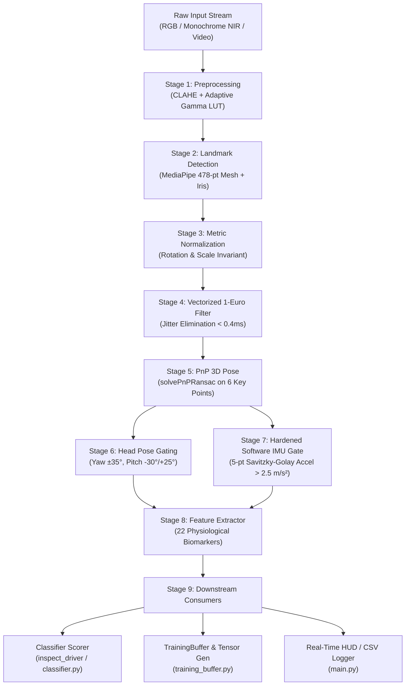

# The Overclocked — Driver Monitoring System (DMS)

[](https://www.python.org/)
[]()
[](https://opensource.org/licenses/MIT)

An edge-optimized, non-intrusive computer vision pipeline designed to quantify driver drowsiness, neurological fatigue, and alcohol-induced impairment from monochrome NIR (near-infrared) or RGB driver-facing camera streams at $\ge 30\text{ fps}$ on standard CPU hardware.

---

## Architecture Overview



---

## 7-Layer Noise Mitigation Architecture

In-cabin automotive environments present extreme visual challenges: engine vibration, pothole shocks, sunlight glares, night shadows, and driver head turns. The system incorporates seven dedicated noise mitigation layers:

1. **Illumination Normalization**: CLAHE ($8\times 8$ tile grid, clip limit 2.0) combined with dual-tier adaptive Gamma LUTs ($0.5$ dark / $0.7$ dim) precomputed into 256-entry lookup tables. In 940nm NIR illumination, melanin absorption is normalized, providing clean iris/pupil contrast across all eye pigmentations.
2. **Landmark Jitter Smoothing (Pre-PnP)**: Vectorized 1-Euro adaptive low-pass filter (Casiez et al., CHI 2012) operating across all 478 3D landmarks simultaneously via NumPy vectorization in $<0.4\text{ ms}$ before PnP pose estimation, preventing non-linear rotational chatter in $R$ and $t_{\text{vec}}$.
3. **Perspective & Distance Normalization**: Aligns smoothed 2D landmarks against a canonical 3D human head model (`CANONICAL_FACE_3D`) via `solvePnPRansac`. Decouples eye and mouth aspect ratios from camera distance and perspective skew.
4. **Head Pose Gating**: Freezes features when $|\text{yaw}| > 35^\circ$, $\text{pitch} < -30^\circ$ (looking down), or $\text{pitch} > 25^\circ$ (looking up), preventing corrupted feature extraction during blind-spot checks or head turns.
5. **Hardened Software IMU Gate**: Estimates nose-tip 3D linear acceleration via a 5-point non-uniform Savitzky-Golay quadratic polynomial fit with rotational decoupling ($\dot{\theta} < 20^\circ/\text{s}$). If a vertical chassis shock exceeding $2.5\text{ m/s}^2$ occurs without head rotation, triggers a 150ms feature freeze.
6. **Motor Action Hysteresis & FSM**: Saccades use dual-threshold hysteresis ($30^\circ/\text{s}$ onset, $15^\circ/\text{s}$ offset) to prevent micro-jitter cycling. Blinks use a 4-state Finite State Machine (`open` $\to$ `closing` $\to$ `closed` $\to$ `opening` $\to$ `open`) to isolate true downstroke/upstroke trajectories.
7. **Gated Frame Policies**: Configurable handling of corrupted/gated frames via `DROP` (skip), `HOLD_LAST` (propagate last valid physical state), or `INTERPOLATE` (linear lookahead interpolation).

---

## Physiological Biomarker Matrix (22 Signals)

### A. Drowsiness & Fatigue
* **EAR (Eye Aspect Ratio)**: `ear_left`, `ear_right`, `ear_avg` via Soukupová & Čech (2016) 6-point formulation.
* **MAR (Mouth Aspect Ratio)**: Dense 3-vertical-pair lip aperture formula.
* **Blinks & Microsleep**: `blink_detected` (EAR dip below 0.20), `microsleep_detected` (sustained closure $\ge 15$ frames / 500ms).
* **Yawning**: `yawn_detected` (MAR $> 0.60$ for $\ge 30$ frames / 1.0s).
* **PERCLOS**: Sliding 60-second percentage of eye closure.

### B. Iris & Gaze Tracking
* **Iris Centroids**: Normalized $[-1, 1]$ coordinates `left_iris_x`, `left_iris_y`, `right_iris_x`, `right_iris_y`.

### C. Alcohol-Discriminating Kinematic Features (Involuntary Motor Dynamics)
* **Saccadic Velocity & Latency**: Angular velocity ($\text{deg/s}$) of iris displacement; inter-saccadic fixation latency.
* **Blink Closing/Opening Velocity**: Involuntary downstroke and upstroke levator palpebrae speed ($\text{EAR/s}$). Resistant to conscious faking.
* **Gaze Yaw Dispersion ($\sigma_{\text{yaw}}$)**: Rolling standard deviation of horizontal gaze over 15s to detect **gaze tunneling** toward the road center.

### D. Advanced Oculomotor & Brainstem Signals
* **Gaze-Evoked Nystagmus (GEN)**: Detects cerebellar/brainstem neural integrator leakage during sustained eccentric gaze ($2\text{--}18^\circ/\text{s}$ centripetal drift + $\ge 30^\circ/\text{s}$ corrective reset beats).
* **Smooth Pursuit Fragmentation Ratio**: Tracks breakdown of fluid pursuit into corrective catch-up saccades.
* **Binocular Vergence & LOC**: Measures net vergence angle and flags Lack of Convergence (DRE strabismus sign).
* **Vestibulo-Ocular Reflex (VOR) Gain**: Evaluates compensatory counter-rotation gain $-\frac{d(\text{eye\_yaw})}{d(\text{head\_yaw})}$ during head micro-tremors (PMC8997842).

### E. Static Visual & Facial Tone
* **Facial Asymmetry Subtraction**: Supports driver resting asymmetry baseline subtraction (`excess_asymmetry = max(0.0, raw - baseline)`), preventing false-positive alerts on naturally asymmetric faces.
* **Conjunctival Sclera Redness**: Measures bloodshot vascular dilation on isolated sclera pixels.
* **Head Slump & Tilt**: 3D Euler angles `head_pitch`, `head_yaw`, `head_roll`.

---

## Repository Structure

```
driver-monitor/
├── config.py                 # Central configuration dataclass & tunable thresholds
├── main.py                   # Real-time CLI application with OpenCV HUD & CSV logging
├── inspect_driver.py         # Diagnostic tool for single-image / webcam analysis
├── idd_ingest.py             # Batch ingestion engine for Toyota IDD driving dataset
├── requirements.txt          # Python package dependencies
├── models/
│   └── face_landmarker.task  # MediaPipe 478-point landmark bundle (auto-downloads if absent)
├── pipeline/
│   ├── frame_capture.py       # Polymorphic camera/video reader (RGB & monochrome NIR)
│   ├── preprocessing.py       # CLAHE & adaptive Gamma LUT low-light enhancer
│   ├── face_mesh_detector.py  # MediaPipe Face Mesh detector with iris refinement
│   ├── pnp_normalizer.py      # solvePnPRansac pose estimation & metric normalization
│   ├── one_euro_filter.py     # Vectorized temporal low-pass filter (<0.4ms)
│   ├── head_pose_estimator.py # Head pose gating & tracking
│   ├── imu_gate.py            # 5-point Savitzky-Golay quadratic IMU shock gate
│   ├── feature_extractor.py   # Complete 22-signal physiological feature extractor
│   ├── classifier.py          # Impairment diagnostic classifier (with baseline subtraction)
│   └── training_buffer.py     # 29-channel windowed numpy tensor generator for ML models
├── tests/                    # Comprehensive automated test suite (59 passing tests)
│   ├── test_advanced_impairment.py
│   ├── test_alcohol_signals.py
│   ├── test_classifier.py
│   ├── test_ear.py
│   ├── test_imu_gate.py
│   ├── test_integration.py
│   ├── test_one_euro.py
│   ├── test_pnp.py
│   ├── test_training_buffer.py
│   └── test_variable_framerate.py
└── utils/
    ├── landmarks.py           # Canonical 3D model & MediaPipe landmark constants
    └── visualization.py       # OpenCV heads-up telemetry display
```

---

## Installation & Quickstart

### 1. Prerequisites
Python 3.9, 3.10, 3.11, 3.12, 3.13, or 3.14.

```bash
# Clone the repository
git clone https://github.com/Thanos3541R/The_Overclocked.git
cd The_Overclocked

# Install dependencies
pip install -r requirements.txt
```

### 2. Run Real-Time Driver Monitoring
```bash
# Launch live camera feed with HUD overlay
python main.py

# Run on a recorded video file with CSV output
python main.py --source /path/to/video.mp4 --save-csv
```

### 3. Run Static Facial Assessment
```bash
python inspect_driver.py --image path/to/photo.jpg
```

### 4. Run Batch Training Data Ingestion (Toyota IDD)
```bash
python idd_ingest.py --idd-root /path/to/dataset --output-dir ./idd_output/
```

### 5. Run the Automated Test Suite
```bash
pytest tests/ -v
```

All 59 unit and integration tests execute in $<1.0\text{ second}$.

---

## License

This project is licensed under the MIT License.
