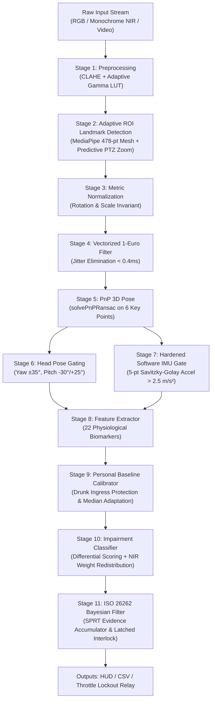

# The Overclocked — Driver Monitoring System (DMS)

[](https://www.python.org/)
[]()
[](https://opensource.org/licenses/MIT)

An automotive-grade, edge-optimized computer vision and biophysical intelligence pipeline designed to quantify driver drowsiness, neurological fatigue, and alcohol-induced impairment from monochrome NIR (near-infrared) or RGB driver-facing camera streams at real-time speeds on standard CPU hardware.

---

## Key System Innovations

### 1. Long-Range Face Detection & Adaptive Predictive ROI Tracking
* **The Problem**: Standard MediaPipe FaceLandmarker scales the full $1280 \times 720$ camera image down to $192 \times 192$ before running the BlazeFace detector. When a driver sits back at normal driving distances ($1.2\text{--}2.5\text{ meters}$), their face shrinks to $\approx 80\text{ pixels}$ in the camera frame—becoming only **$12\text{ pixels}$ in the model's receptive field**, falling below BlazeFace's $32\text{ px}$ anchor stride and causing sudden tracking dropouts.
* **The Solution**: An **Adaptive Predictive ROI Tracker** (`AdaptiveROITracker` in `pipeline/face_mesh_detector.py`) with Exponential Moving Average (EMA, $\alpha=0.35$) temporal smoothing:
  - Crops an expanded high-resolution patch ($2.0\times$ bounding box, strictly square) directly from the raw $1280 \times 720$ frame.
  - When passed into MediaPipe, the face fills **$60\%\text{--}80\%$ of the model's receptive field**, delivering an **$\sim 8\times$ effective resolution boost** (a 12-pixel face becomes **96 pixels** inside the detector).
  - Subpixel coordinate remapping converts crop-relative landmarks back to global full-frame pixel coordinates with precision $< 10^{-5}\text{ px}$.
  - **Multi-Scale Pyramid Acquisition**: On startup (frame 0) or when tracking is lost, if full-frame detection misses a distant user, the detector automatically evaluates the **Central Driver Quadrant Crop** ($[0.2 W, 0.1 H]$ to $[0.8 W, 0.85 H]$), immediately acquiring distant drivers without requiring them to lean forward.
  - **DirectShow MJPG Hardware Negotiation**: In `pipeline/frame_capture.py`, enforces Windows `cv2.CAP_DSHOW` and negotiates `MJPG` fourcc to guarantee full $1280 \times 720$ HD capture without silent fallback to 480p.

### 2. ISO 26262 ASIL-B/D Sequential Bayesian Evidence Accumulator
* Mediates vehicle engine lockout and throttle attenuation (`pipeline/bayesian_filter.py`) using Wald's Sequential Probability Ratio Test (SPRT).
* **Anti-Chattering Leaky Integrator**: When posterior certainty flickers below threshold ($P < 0.999$), the sustained timer decays at a leaky rate of $-2.0 \cdot dt$ rather than resetting to zero. A brief 2-frame optical noise blip (66ms) at second 14.2 subtracts only 132ms instead of wiping out 14+ seconds of evidence.
* **Lockout Latching**: Once lockout is confirmed ($P \ge 0.999$ sustained for $\ge 15.0\text{s}$), the system enters a **latched state**. Brief eye-opening or head freezing cannot unlatch the system; unlatching requires vehicle park gear confirmation (`unlatch(park_gear_confirmed=True)`).

### 3. Personal Baseline Auto-Calibration & Drunk Ingress Protection
* Online calibration engine (`pipeline/calibration.py`) accumulates resting medians during the initial driving period (30–60s) to personalize baselines for anatomical asymmetry, eyelid morphology, and blink kinetics.
* **Drunk Ingress Protection**: Enforces biophysical sanity clamps:
  - $\text{EAR} \in [0.25, 0.38]$ (median sober ~0.28)
  - $v_{\text{up}} \in [1.80, 3.20]\text{ EAR/s}$ (median sober ~2.50 EAR/s)
  - $\text{Asymmetry} \le 0.05$
  If an intoxicated driver enters with droopy eyes ($\text{EAR} < 0.25$) or sluggish kinetics ($v_{\text{up}} < 1.80\text{ EAR/s}$), the calibrator trips `ingress_impairment_detected = True`, locks baselines to conservative population sober norms, and fires a `CRITICAL INGRESS ALERT` ($\ge 55\%$ risk) in `pipeline/classifier.py`.

### 4. Monochrome NIR Invariance & Dynamic Weight Redistribution
* Auto-detects single-channel grayscale or monochrome 940nm NIR input via `is_monochrome_frame(frame)`.
* Bypasses visible-light chromaticity calculations (facial flushing, sclera redness) under NIR.
* In `pipeline/classifier.py`, the 5% sclera redness weight is dynamically reallocated across structural markers (ptosis: $0.526$, head slump: $0.263$, asymmetry: $0.105$, jaw: $0.105$, sum $= 1.000$) so night-time NIR operation is not penalized.

### 5. Road Suspension Vibration De-trending
* Single-camera seated postural sway in the $0.5\text{--}2.0\text{ Hz}$ band overlaps with vehicle chassis washboard and suspension resonance.
* High-pass de-trended ($\sqrt{\sigma_{\text{pitch}}^2 + \sigma_{\text{roll}}^2}$) and demoted to **0% lockout weight**, acting strictly as a $+5\%$ corroborating bonus only when base involuntary impairment is already $\ge 20\%$.

---

## Voluntary vs. Involuntary Biomarkers Under Intoxication

For a passive, non-cooperative driver monitoring system, distinguishing between **involuntary** and **voluntary** signals is essential to prevent gaming:
* **Section A — Involuntary Biomarkers (High Evidential Weight for Lockout)**:
  - **Horizontal Gaze Nystagmus (HGN / GEN)**: Leaky neural integrator at lateral gaze ($\ge 2$ corrective beats, $2\text{--}18^\circ/\text{s}$ centripetal drift).
  - **Smooth Pursuit Fragmentation**: Breakdown into catch-up saccades ($> 15\%$).
  - **Vestibulo-Ocular Reflex (VOR) Gain**: Micro-counter-rotation depression ($< 0.70$ vs normal $0.85\text{--}1.05$; 0% lockout authority).
  - **Binocular Vergence & LOC**: Lack of Convergence (DRE strabismus sign, vergence $<-3.5^\circ$).
  - **Involuntary Blink Upstroke Speed**: Sluggish levator palpebrae reopening ($< 1.2\text{ EAR/s}$).
  - **Low-Frequency Postural Sway**: Cerebellar micro-tremor and vestibular head wobble ($\text{sway} > 1.40^\circ$).
  - **Facial Flushing / Vasodilation**: Micro-vascular perfusion in cheek landmarks ($R / \frac{G+B}{2} > 1.15$).
* **Section B — Voluntary & Semi-Voluntary Changes (Masking & Gaming Indicators)**:
  - **Deliberate Blink Suppression**: Actively fighting eyelid droop with prolonged inter-blink intervals ($> 6.0\text{s}$).
  - **Voluntary Eye-Widening Spikes**: Transient frontalis/levator contraction surges ($\text{EAR} > 1.25\times \text{baseline}$) following droop episodes.
  - **Compensatory Staring Fixation**: Unbroken central gaze without natural exploratory micro-saccades ($> 6.0\text{s}$, $\sigma_{\text{gaze}} < 0.8^\circ$).
  - **Rigid Head Stabilization**: Unnatural cervical muscle locking to freeze natural head sway.
* **Anti-Masking Divergence Metric ($M_{\text{mask}}$)**:
  $$M_{\text{mask}} = \text{Kinetic Mismatch} \left(\frac{f_{\text{blink}}}{\bar{f}} \times \frac{\bar{v}_{\text{sober}}}{v_{\text{up}}}\right) + \text{Behavioral Discordance Bonus}$$
  When both involuntary reflex breakdown and voluntary suppression co-occur, $M_{\text{mask}} \ge 50.0\%$ triggers an anti-masking alert and confirms conscious gaming.

---

## Architecture Overview



---

## 7-Layer Noise Mitigation Architecture

1. **Illumination Normalization**: CLAHE ($8\times 8$ tile grid, clip limit 2.0) combined with dual-tier adaptive Gamma LUTs ($0.5$ dark / $0.7$ dim) precomputed into 256-entry lookup tables.
2. **Landmark Jitter Smoothing (Pre-PnP)**: Vectorized 1-Euro adaptive low-pass filter (Casiez et al., CHI 2012) operating across all 478 3D landmarks simultaneously in $<0.4\text{ ms}$ before PnP pose estimation.
3. **Perspective & Distance Normalization**: Aligns smoothed 2D landmarks against a canonical 3D human head model (`CANONICAL_FACE_3D`) via `solvePnPRansac`.
4. **Head Pose Gating**: Freezes features when $|\text{yaw}| > 35^\circ$, $\text{pitch} < -30^\circ$ (looking down), or $\text{pitch} > 25^\circ$ (looking up).
5. **Hardened Software IMU Gate**: Estimates nose-tip 3D linear acceleration via a 5-point non-uniform Savitzky-Golay quadratic polynomial fit with rotational decoupling ($\dot{\theta} < 20^\circ/\text{s}$). If vertical acceleration exceeds $2.5\text{ m/s}^2$, triggers a 150ms feature freeze with velocity state holdover (`HOLD_LAST`).
6. **Motor Action Hysteresis & FSM**: Saccades use dual-threshold hysteresis ($30^\circ/\text{s}$ onset, $15^\circ/\text{s}$ offset). Blinks use a 4-state Finite State Machine (`open` $\to$ `closing` $\to$ `closed` $\to$ `opening` $\to$ `open`).
7. **Adaptive Predictive ROI Zoom**: Crops an expanded square bounding box ($2.0\times$ face size) to keep distant faces at high resolution inside the landmark detector.

---

## Sensor & Frame Rate Specifications

| Operating Domain | Frame Rate | Shutter Type | Target Biomarkers | Kinematic Fidelity |
| :--- | :---: | :---: | :--- | :--- |
| **Desktop / Dev Fallback** | $30\text{ fps}$ | Rolling Shutter | PERCLOS, Yawn (MAR), Head Slump, Static Asymmetry, Sclera Redness | **Coarse**: $33.3\text{ ms}$ interval; acceptable for macro-movements |
| **Production Automotive / Forensic** | $\ge 60\text{--}120\text{ fps}$ | **Global Shutter** (NIR 940nm) | Involuntary Blink Velocities ($|d\text{EAR}/dt|$), Saccadic Peak Speeds ($200\text{--}900^\circ/\text{s}$), VOR Micro-Gain | **Forensic**: Downstroke (50–100ms) resolved across 6–12+ frames with minimal quantization noise |

---

## Repository Structure

```
driver-monitor/
├── config.py                 # Central configuration dataclass & tunable thresholds
├── main.py                   # Real-time CLI application with OpenCV HUD & CSV logging
├── inspect_driver.py         # Diagnostic tool for single-image / webcam analysis
├── export_feature_output.py  # Feature extraction export tool (TXT, JSON, CSV)
├── extract_video_features.py # Batch video analyzer with Section A/B report generation
├── idd_ingest.py             # Batch ingestion engine for Toyota IDD driving dataset
├── train_baseline.py         # ML training pipeline with GroupKFold & 203 window features
├── requirements.txt          # Python package dependencies
├── models/
│   ├── face_landmarker.task  # MediaPipe 478-point landmark bundle (auto-downloads if absent)
│   ├── baseline_impairment_model.joblib # Trained gradient-boosted classifier
│   └── training_report.json  # Cross-validation performance report
├── pipeline/
│   ├── frame_capture.py       # Polymorphic camera/video reader (DirectShow, MJPG, RGB & NIR)
│   ├── preprocessing.py       # CLAHE & adaptive Gamma LUT low-light enhancer
│   ├── face_mesh_detector.py  # MediaPipe Face Mesh detector with AdaptiveROITracker & Multi-Scale Zoom
│   ├── pnp_normalizer.py      # solvePnPRansac pose estimation & metric normalization
│   ├── one_euro_filter.py     # Vectorized temporal low-pass filter (<0.4ms)
│   ├── head_pose_estimator.py # Head pose gating & tracking
│   ├── imu_gate.py            # 5-point Savitzky-Golay quadratic IMU shock gate
│   ├── feature_extractor.py   # Complete 22-signal physiological feature extractor
│   ├── calibration.py         # Personal baseline calibrator with Drunk Ingress bounding
│   ├── classifier.py          # Impairment diagnostic classifier (with baseline subtraction & NIR weights)
│   ├── bayesian_filter.py     # Sequential Bayesian evidence accumulator with ISO 26262 latching
│   └── training_buffer.py     # 29-channel windowed numpy tensor generator for ML models
├── tests/                    # Comprehensive automated test suite (144 passing tests)
│   ├── test_advanced_impairment.py
│   ├── test_alcohol_signals.py
│   ├── test_bayesian_filter.py
│   ├── test_calibration.py
│   ├── test_classifier.py
│   ├── test_ear.py
│   ├── test_face_mesh_detector.py
│   ├── test_imu_gate.py
│   ├── test_integration.py
│   ├── test_one_euro.py
│   ├── test_optimizations_and_fixes.py
│   ├── test_pnp.py
│   ├── test_training_buffer.py
│   ├── test_variable_framerate.py
│   └── test_voluntary_involuntary.py
└── utils/
    ├── landmarks.py           # Canonical 3D model & MediaPipe landmark constants
    └── visualization.py       # OpenCV heads-up telemetry display
```

---

## Installation & Quickstart

### 1. Prerequisites
Python 3.9, 3.10, 3.11, 3.12, 3.13, or 3.14.

```bash
# Clone the repository
git clone https://github.com/Thanos3541R/The_Overclocked.git
cd The_Overclocked

# Install dependencies
pip install -r requirements.txt
```

### 2. Run Real-Time Driver Monitoring
```bash
# Launch live camera feed with HUD overlay
python main.py

# Run on a recorded video file with CSV output
python main.py --source /path/to/video.mp4 --save-csv

# Run with reduced wireframe rendering for maximum FPS (25-30+ FPS)
python main.py --no-mesh
```

### 3. Machine Learning Model Training & Evaluation
```bash
# Run self-test benchmark with multi-subject GroupKFold cross-validation
python train_baseline.py --test-synthetic

# Train on ingested dataset archives
python train_baseline.py --data-dir ./idd_output/ --output-model models/trained_model.joblib
```

### 4. Automated Video Feature Extraction & Anti-Masking Report
```bash
python extract_video_features.py --video /path/to/video.mp4 --output-dir .
```
Generates 3 forensic artifacts:
* `video_features_report.txt` — Formatted clinical & lockout audit report separating Section A vs Section B.
* `video_features.csv` — Full time-series CSV with all frame-by-frame biomarkers.
* `video_features_summary.json` — Machine-readable summary metrics and ML risk payload.

### 5. Static Facial Assessment & Feature Extraction
```bash
python export_feature_output.py
python inspect_driver.py --image path/to/photo.jpg
```

### 6. Batch Training Data Ingestion (Toyota IDD & DIF)
```bash
python idd_ingest.py --idd-root /path/to/dataset --output-dir ./idd_output/
```

### 7. Run the Automated Test Suite
```bash
pytest tests/ -v
```
All **144 unit and integration tests** execute in $\approx 11\text{ seconds}$ with a 100% pass rate.

---

## License

This project is licensed under the MIT License.
